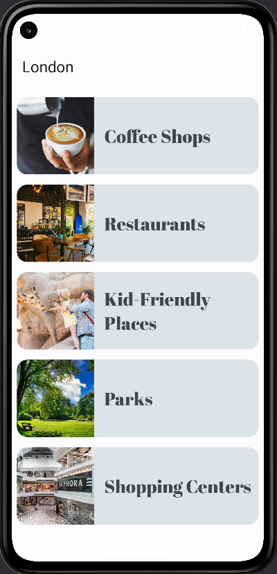
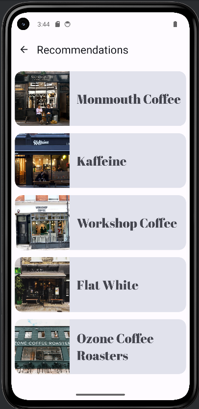

# My-City

Discover fascinating places with this app! It provides comprehensive information about interesting locations in London, making it easy to explore and learn about them.

## Description

This app is your ultimate guide to discovering the best places in London. Choose from five categories of locations, each offering a unique experience. Once you select a category, you'll be presented with five top recommendations curated just for you. Dive deeper by selecting a specific place to access detailed information, including key highlights, location details, and insider tips. Whether you're a local or a visitor, this app makes exploring London effortless and exciting.

## Features

Highlight the key features of your app.

*   🌍 Explore five categories of places in London.
*   📍 Get top five recommendations in each category.
*   🏛️ View detailed information about each location.
*   🎨 Modern UI built with Jetpack Compose.
*   📡 Works offline.

## Screenshots

Here are some key screens of the app:

<table>
  <tr>
    <td>
      
      <p align="center">Home Screen</p>
    </td>
    <td>
      
      <p align="center">Coffee Recommendations</p>
    </td>
    <td>
      
      <p align="center">Flight Destinations</p>
    </td>
  </tr>
</table>

## Tech Stack

List the technologies used in the app.

*   Language: Kotlin
*   Framework: Jetpack Compose
*   Navigation: Android Jetpack Navigation
*   State Management: ViewModel & Dependency Injection

## Installation

To run this project, follow these steps:

1.  **Prerequisites:**
    *   Android Studio installed on your machine.
    *   An Android emulator or a physical Android device.

2.  **Clone the repository:**

    ```bash
    git clone https://github.com/Qume02/MyCity.git
    ```

3.  **Open in Android Studio:**
    *   Launch Android Studio.
    *   Select "Open an existing project" and navigate to the cloned `MyCity` directory.

4.  **Build and Run:**
    *   Once the project is loaded, allow Gradle to sync and build.
    *   Select your desired emulator or connected Android device in Android Studio.
    *   Click the "Run" button (or press `Shift+F10`).

5.  **Explore the App:**
    *   Once the app is running, you can start exploring places in London through the app's categories and recommendations.
