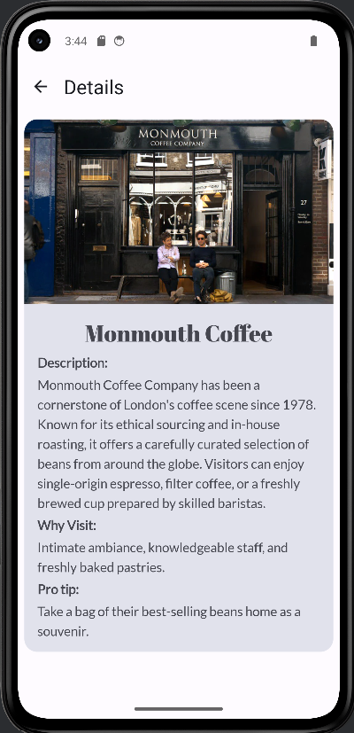

# My-City
Discover fascinating places with this app! It provides comprehensive information about interesting locations in London, making it easy to explore and learn about them.

## Description
This app is your ultimate guide to discovering the best places in London. Choose from five categories of locations, each offering a unique experience. Once you select a category, you'll be presented with five top recommendations curated just for you. Dive deeper by selecting a specific place to access detailed information, including key highlights, location details, and insider tips. Whether you're a local or a visitor, this app makes exploring London effortless and exciting

## Features
Highlight the key features of your app.

    🌍 Explore five categories of places in London.
    📍 Get top five recommendations in each category.
    🏛️ View detailed information about each location.
    🎨 Modern UI built with Jetpack Compose.
    📡 Works offline.
## Screenshots

Include images or GIFs of your app's interface to give users a preview. You can upload images and reference them like this:

    

## Tech Stack

List the technologies used in the app.

    Language: Kotlin
    Framework: Jetpack Compose
    Navigation: Android Jetpack Navigation
    State Management: ViewModel & Dependency Injection

## Installation

git clone https://github.com/Qume02/MyCity.git

cd MyCity  
./gradlew build 
